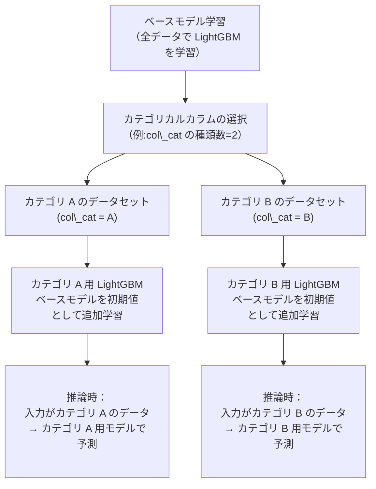

```mermaid
flowchart TD

    A["ベースモデル学習<br/>（全データで LightGBM<br/> を学習）"] --> 
    B["カテゴリカルカラムの選択<br/>（例:col\_cat の種類数=2）"]

    %% データセットの分割（2種類のカテゴリ）
    B --> B0["カテゴリ A のデータセット<br/>(col\_cat = A)"]
    B --> B1["カテゴリ B のデータセット<br/>(col\_cat = B)"]

    %% カテゴリごとの追加学習（LightGBM）
    B0 --> C0["カテゴリ A 用 LightGBM<br/>ベースモデルを初期値<br/>として追加学習"]
    B1 --> C1["カテゴリ B 用 LightGBM<br/>ベースモデルを初期値<br/>として追加学習"]

    %% 推論時のモデル選択
    C0 --> D["&nbsp;&nbsp;&nbsp;&nbsp;<br/>推論時：<br/> 入力がカテゴリ A のデータ<br/>→ カテゴリ A 用モデルで<br/>予測<br/>&nbsp;&nbsp;&nbsp;&nbsp;"]
    C1 --> E["&nbsp;&nbsp;&nbsp;&nbsp;<br/>推論時：<br/> 入力がカテゴリ B のデータ<br/>→ カテゴリ B 用モデルで<br/>予測<br/>&nbsp;&nbsp;&nbsp;&nbsp;"]
```